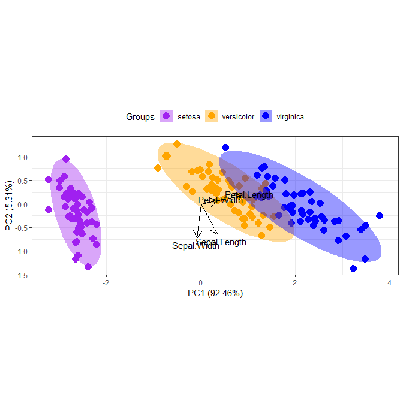
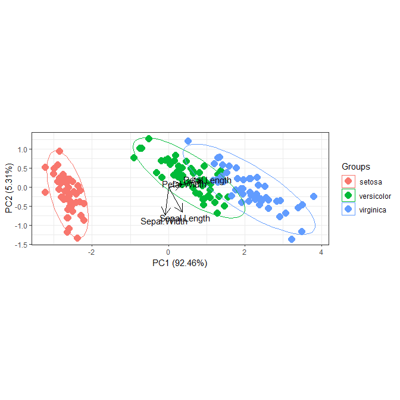
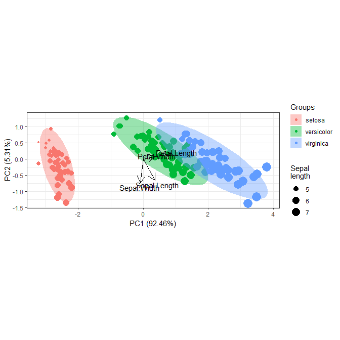
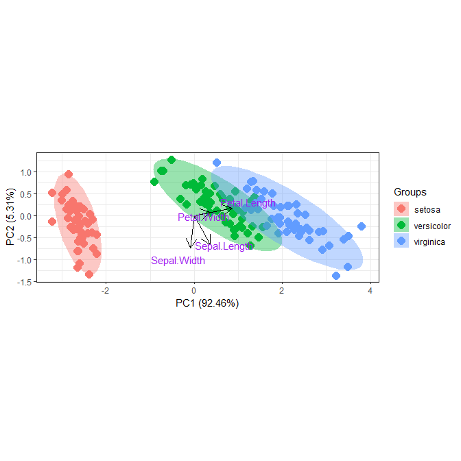
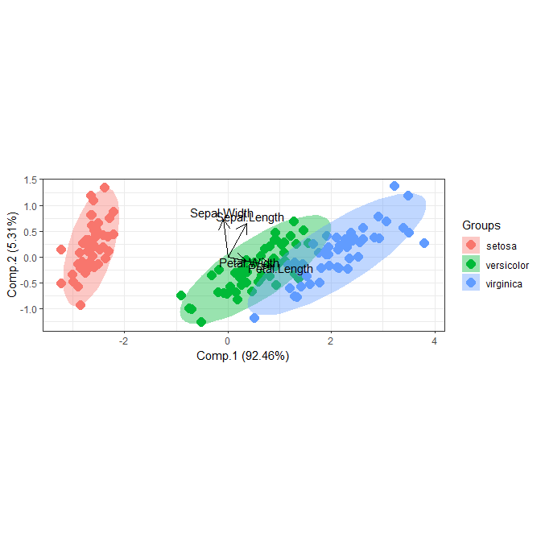

## ggord

#### *Marcus W. Beck, mbafs2012@gmail.com*

[](https://travis-ci.org/fawda123/ggord)

A simple package for creating ordination plots with ggplot2 (aka reinventing the wheel, see [this](https://github.com/vqv/ggbiplot) and [this](https://github.com/kassambara/factoextra)).  Install the package as follows:


```r
install.packages(devtools)
library(devtools)
install_github('fawda123/ggord')
library(ggord)
```

The following shows some examples of creating biplots using the methods available with ggord.  These methods were developed independently from the [ggbiplot](https://github.com/vqv/ggbiplot) and [factoextra](https://github.com/kassambara/factoextra) packages, though the biplots are practically identical.  I made liberal use of the ellipses feature from ggbiplot, so credit is given where credit is due.  Most methods are for results from principal components analysis, although methods are available for nonmetric multidimensional scaling, multiple correspondence analysis, correspondence analysis, and linear discriminant analysis.  Available methods are as follows:

```
##  [1] ggord.acm      ggord.ca       ggord.coa      ggord.default 
##  [5] ggord.lda      ggord.mca      ggord.MCA      ggord.metaMDS 
##  [9] ggord.pca      ggord.PCA      ggord.prcomp   ggord.princomp
```

```r
# principal components analysis with the iris data set
# prcomp
ord <- prcomp(iris[, 1:4])

p <- ggord(ord, iris$Species)
p
```

 

```r
p + scale_colour_manual('Species', values = c('purple', 'orange', 'blue'))
```

 

```r
p + theme_classic()
```

 

```r
p + theme(legend.position = 'top')
```

 

```r
p + scale_x_continuous(limits = c(-2, 2))
```

 

```r
# principal components analysis with the iris dataset
# princomp
ord <- princomp(iris[, 1:4])

ggord(ord, iris$Species)
```

 

```r
# principal components analysis with the iris dataset
# PCA
library(FactoMineR)

ord <- PCA(iris[, 1:4], graph = FALSE)

ggord(ord, iris$Species)
```

 

```r
# principal components analysis with the iris dataset
# dudi.pca
library(ade4)

ord <- dudi.pca(iris[, 1:4], scannf = FALSE, nf = 4)

ggord(ord, iris$Species)
```

 

```r
# multiple correspondence analysis with the tea dataset
# MCA
data(tea)
tea <- tea[, c('Tea', 'sugar', 'price', 'age_Q', 'sex')]

ord <- MCA(tea[, -1], graph = FALSE)

ggord(ord, tea$Tea)
```

 

```r
# multiple correspondence analysis with the tea dataset
# mca
library(MASS)

ord <- mca(tea[, -1])

ggord(ord, tea$Tea)
```

 

```r
# multiple correspondence analysis with the tea dataset
# acm
ord <- dudi.acm(tea[, -1], scannf = FALSE)

ggord(ord, tea$Tea)
```

 

```r
# nonmetric multidimensional scaling with the iris dataset
# metaMDS
library(vegan)
ord <- metaMDS(iris[, 1:4])

ggord(ord, iris$Species)
```

 

```r
# linear discriminant analysis
# example from lda in MASS package
ord <- lda(Species ~ ., iris, prior = rep(1, 3)/3)

ggord(ord, iris$Species)
```

 

```r
# correspondence analysis
# dudi.coa
ord <- dudi.coa(iris[, 1:4], scannf = FALSE, nf = 4)

ggord(ord, iris$Species)
```

 

```r
# correspondence analysis
# ca
library(ca)
ord <- ca(iris[, 1:4])

ggord(ord, iris$Species)
```

 

